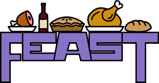

# FEAST Framework

## Fast, Easy, Agile, Slim, Tested and Trans-Fat Free.

## Create a Project with FEAST
For the simplest way to get started see [FeastFramework/feast](https://github.com/FeastFramework/Feast).

## Documentation

Get started with FEAST by reading the [docs](https://docs.feast-framework.com).

[Contributing to FEAST](docs/CONTRIBUTING.md)

[Contributors](docs/contributors.md)
